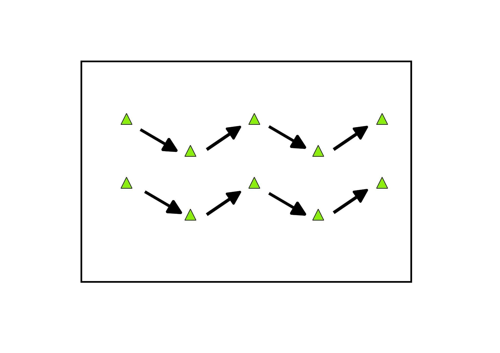
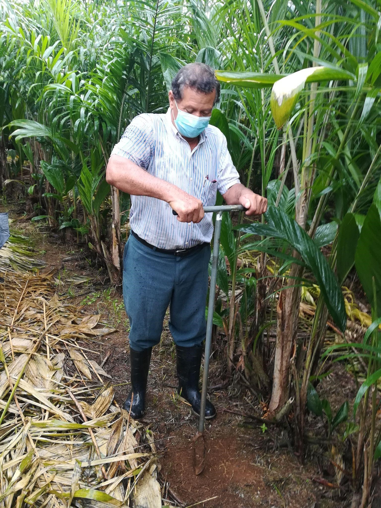

# Muestreo de suelos de pejibaye para palmito en Sarapiquí

## Antecedentes y Justificación

El pejibaye para palmito se sembró en Costa Rica a inicios de la década de 1970 y su cultivo se desarrolló hasta convertirse en un rubro de exportación importante dentro de los no tradicionales. Los lugares en donde se encuentran siembras son: Upala, Guatuso, Pital, Río Cuarto, Puerto Viejo, Sarapiquí, Pococí, Guácimo, Siquirres, Limón, Jiménez de Cartago y Osa.

La actividad ha generado más de __20 millones__ de dólares en un año por exportaciones y ha sobrepasado las 9000 ha sembradas (SEPSA, 2009). El número de productores con palmito, por momentos ha sobrepasado los 1 000, distribuidos en casi todo el país.

En este sentido, es oportuno apoyar a los productores con una visita para una inducirles sobre la toma de muestras de suelos, realizar los análisis del caso y brindarles un informe sobre la interpretación de fertilidad química de suelos y las medidas correctivas del manejo de la nutrición del cultivo, así como de algunas prácticas complementarias.

## Metodología

Se realizó un análisis preliminar de gabinete con información de algunas fincas de productores de palmito suministradas por la AEA, así como la distribución de suelos del distrito, con el criterio de los agentes de extensión, el [mapa suelos CIA-UCR](http://www.cia.ucr.ac.cr/es/mapa-de-suelos-de-costa-rica) escala 1:200 000 y la topografía del terreno con base en un modelo de elevación digital generado a partir de curvas de nivel cada 30 m.

### Estrategia de muestreo

Se muestrearon tres y dos lotes de dos fincas en San Isidro y La Chaves respectivamente y se consideró que el área fuese representativa. Se tomaron entre 10-15 submuestras de 0-20 cm de profundidad del suelo con un patrón de recorrido definido (figura 1), mediante el uso de un barreno *tipo holandés* (Edelman). En el centro de cada lote se tomaron las coordenadas con la aplicación móvil __Map marker__, posteriormente las muestras de suelo se cuartearon, se etiquetaron y se enviaron al laboratorio de suelos del INTA para la determinación de nutrientes. 

Figura 1. Patrón de recorrido para la toma de submuestras en campo. Horquetas, Sarapiquí.

### Toma de muestras 

En el muestreo participaron tres productores y cuatro técnicos en la finca de Juan Pablo y dos productores y dos técnicos en la finca de Salvador. Los participantes interactuaron con todo el procedimiento, relacionado a definición del número de muestras por área, la división de los lotes según diferencias entre ellos, el sitio de muestreo, en este caso la banda de fertilización, la cantidad de submuestras así como el uso del barreno, el cuarteo y la identificación de la muestra final (figura 2).

Figura 2. Productor en San Isidro haciendo una submuestra.

### Análisis químico de muestras

Las muestras fueron ingresadas en el laboratorio de suelos del INTA, se secaron al aire a 60°C por *48 horas*, se molieron y tamizaron (con tamiz de 2 mm), para finalmente realizar la determinación de nutrientes; los métodos se resumen a continuación:

1. K–Fe–Cu–Zn–Mn: Extracción mediante solución de Olsen modificado (NaHCO3 0,5 N + EDTA 0.01 N + “Superfloc” ajustado a pH 8,5 con NaOH). Determinación por espectroscopía de absorción atómica
2. P: Extracción mediante solución de Olsen modificado (NaHCO3 0.5 N + EDTA 0.01 N + “Superfloc” ajustado a pH 8,5 con NaOH). Determinación por espectrofotometría de Ultra Violeta Visible.
3. Materia orgánica: Método de Walkley y Black (1938). Combustión húmeda con dicromato de potasio
4. pH: Potenciométricamente, en relación suelo:agua. 1:2,5
❖	Aluminio intercambiable: Solución extractora KCl 1 M y relación
5. Ca-Mg: Solución extractora de KCl 1 M y relación suelo-solución 1:10. Determinación por espectroscopía por absorción atómica.

## Literatura Citada

1. SEPSA. (Secretaría Ejecutiva de Planificación del Sector Agropecuario, CR). Boletín Estadístico Agropecuario Área de Estudios Económicos e Información. Boletín # 17-19. p 22-69 2007-2009.

